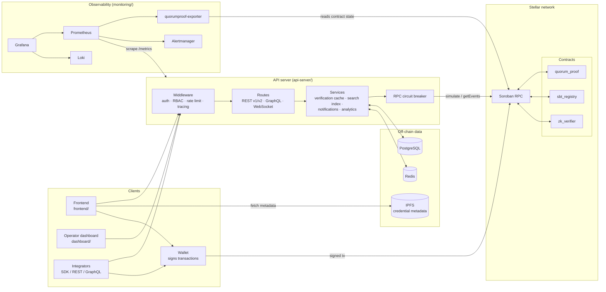
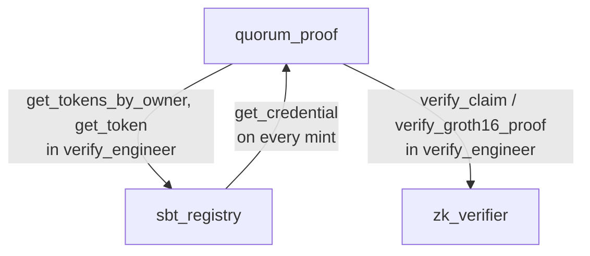
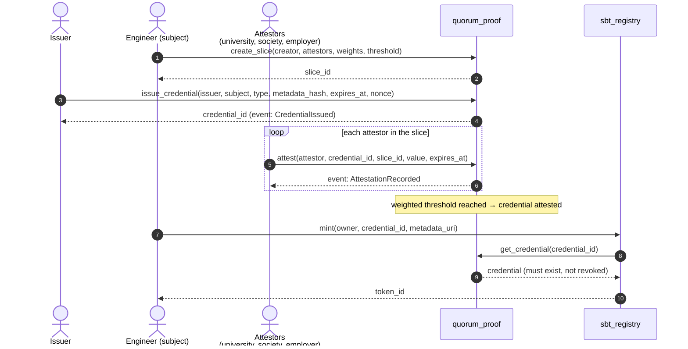
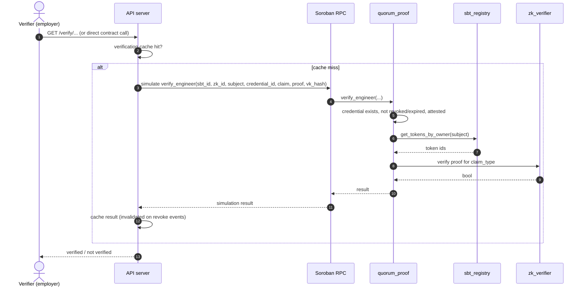
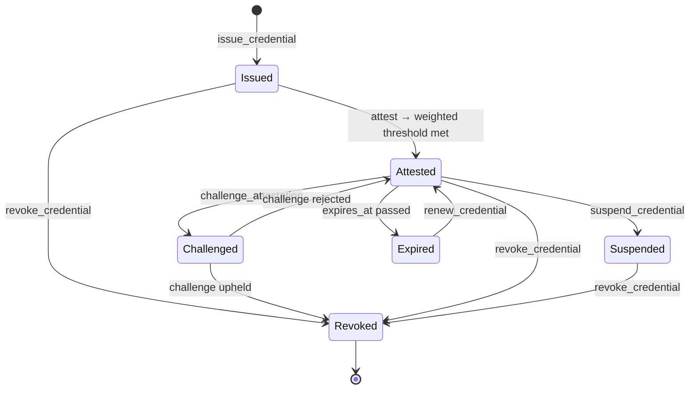
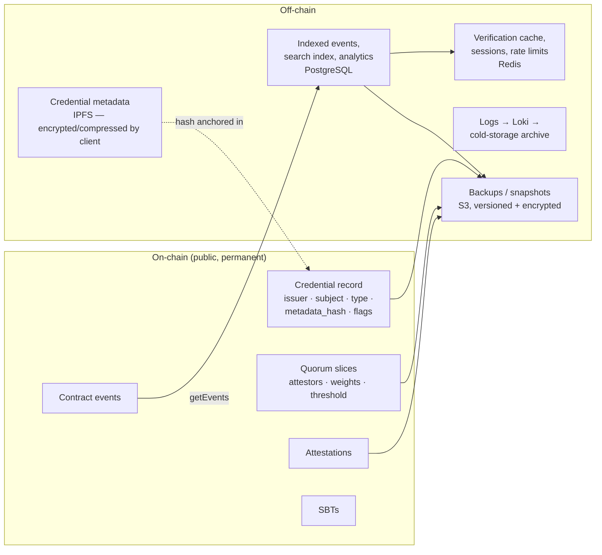
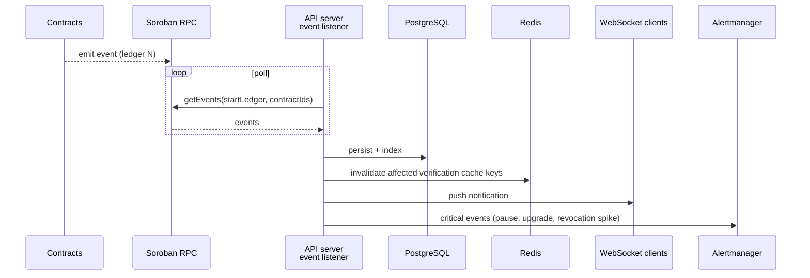
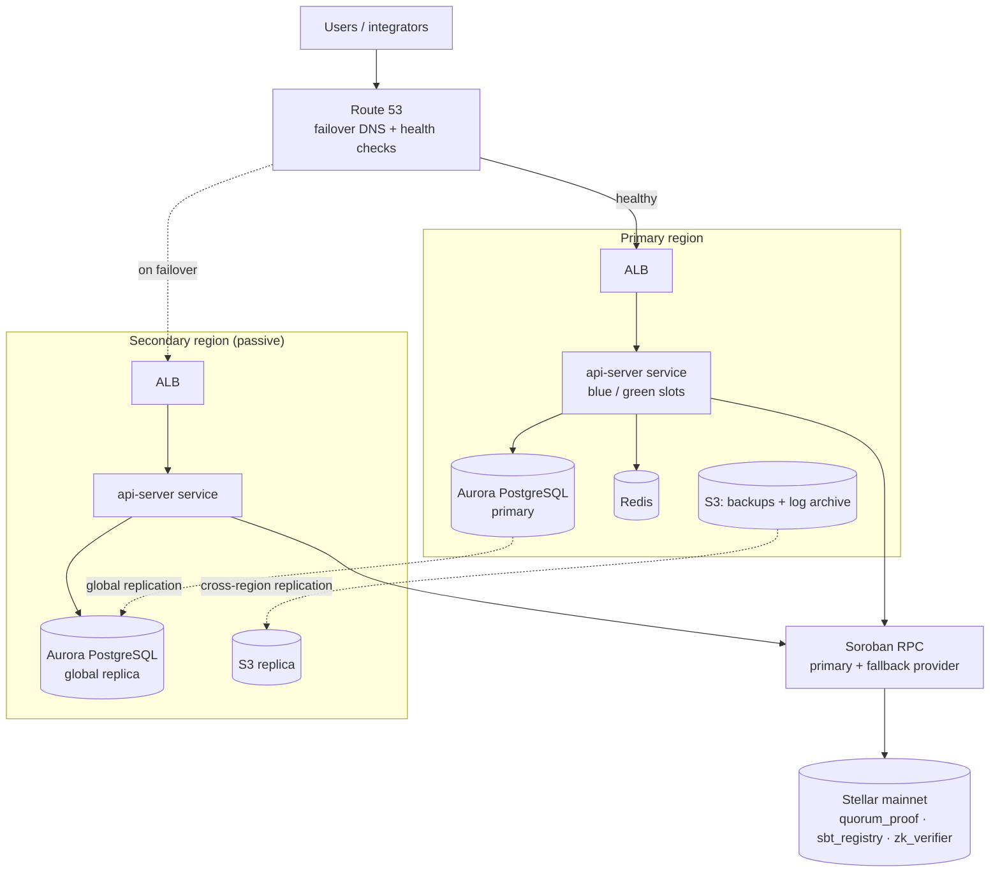
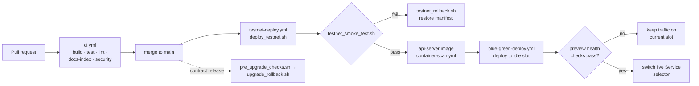

# System Architecture Diagrams

> Issue #1644. These diagrams show how QuorumProof fits together: the overall
> system, how the contracts call each other, how data moves through a
> credential's lifecycle, and how the system is deployed. The prose reference is
> [architecture.md](./architecture.md). The design decisions behind the diagrams
> are recorded in the ADRs, especially
> [ADR-010 (three-contract architecture)](./adr/adr-010-three-contract-architecture.md)
> and [ADR-015 (read-only API server)](./adr/adr-015-read-only-api-server-via-simulation.md).

The diagrams are written in [Mermaid](https://mermaid.js.org/). GitHub renders
them inline, and you can edit them as plain text in a PR. If you change a
contract interface, a deployment manifest or a Terraform module, update the
matching diagram in the same PR.

---

## Table of Contents

1. [System architecture](#1-system-architecture)
2. [Contract interactions](#2-contract-interactions)
3. [Data flow](#3-data-flow)
4. [Deployment](#4-deployment)
5. [Keeping diagrams current](#5-keeping-diagrams-current)

---

## 1. System architecture

The Stellar ledger is the source of truth. Clients sign and submit writes with
their own wallets. The API server never holds user keys. It reads contract
state by simulating calls against Soroban RPC (ADR-015), and it adds indexing,
caching, notifications and analytics on top.

| Component | Responsibility | Source |
|---|---|---|
| `quorum_proof` | Credentials, quorum slices, attestations, disputes, pause/admin | `contracts/quorum_proof` |
| `sbt_registry` | Soulbound tokens bound to credentials; non-transferable | `contracts/sbt_registry` |
| `zk_verifier` | Groth16 / PLONK proof verification over BLS12-381 | `contracts/zk_verifier` |
| API server | Read-only query layer, indexing, auth, notifications | `api-server/` |
| Frontend / dashboard | Holder, issuer and operator UIs | `frontend/`, `dashboard/` |
| Monitoring stack | Metrics, logs, alerts | `monitoring/` |

---

## 2. Contract interactions

### 2.1 Dependency graph

`sbt_registry` stores the `quorum_proof` contract ID at initialization. That's
why it has to be deployed last (see
[Deployment order](./architecture.md#deployment-order)).

### 2.2 Issuance and attestation

### 2.3 Verification

### 2.4 Revocation and dispute

The states are simplified. The authoritative flags and error codes are in
[sdk-methods-reference.md](./sdk-methods-reference.md) and
[error-codes.md](./error-codes.md). SBT consequences are covered in
[sbt-lifecycle.md](./sbt-lifecycle.md).

---

## 3. Data flow

### 3.1 What lives where

Rules the data flow enforces:

- **Personal data never goes on-chain.** Only a `metadata_hash` is stored. The
  metadata is encrypted off-chain before it's stored (see the README note on
  `encrypt_metadata`), and GDPR erasure uses crypto-shredding
  ([crypto-shredding-architecture.md](./crypto-shredding-architecture.md)).
- **The chain is authoritative.** PostgreSQL and Redis are rebuildable
  projections of contract events. If they disagree with the chain, the chain
  wins ([verification-cache-invalidation.md](./verification-cache-invalidation.md)).
- **Writes bypass the API server.** Clients sign transactions and submit them
  to RPC directly.

### 3.2 Event pipeline

---

## 4. Deployment

### 4.1 Runtime topology (production)

Defined in `infra/terraform/` (modules `network`, `compute`, `database`,
`storage`, `failover`, `log-archive`). Staging is a single-region version of
the same stack. Kubernetes manifests for the blue/green api-server are in
`k8s/blue-green/`. See [multi-region-failover.md](./multi-region-failover.md)
and [infrastructure-as-code.md](./infrastructure-as-code.md).

### 4.2 Release pipeline

The operator procedures for each step are in the
[Deployment Runbook](./runbook-deployment.md) and the
[Rollback Runbook](./runbook-rollback.md).

---

## 5. Keeping diagrams current

- Update the diagram in the **same PR** as the change it describes. Reviewers
  should ask for it.
- Keep node labels matched to real names (contract methods, script names,
  Terraform modules) so readers can grep for them.
- Preview locally with the [Mermaid Live Editor](https://mermaid.live) or any
  editor with Mermaid preview. GitHub renders the committed version.
- Stick to `flowchart`, `sequenceDiagram` and `stateDiagram-v2`, which render
  reliably on GitHub.
