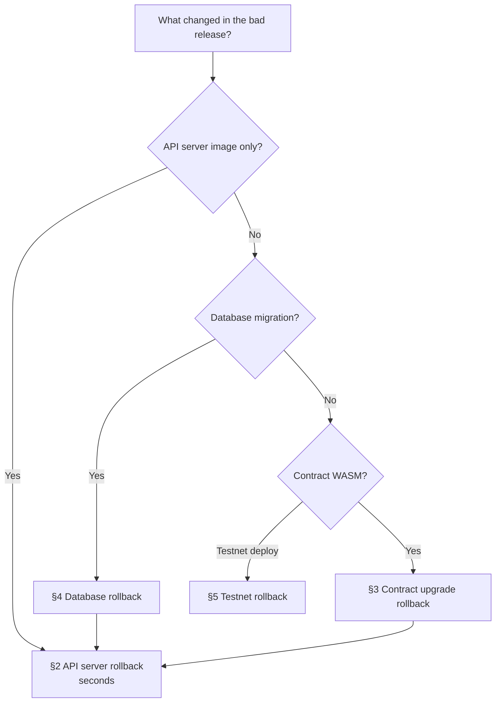

# Runbook: Rollback Procedures

> Issue #1645. How to undo a bad release, for each part of the system. **Roll
> back first and debug afterwards.** If a release is linked to a user-facing
> regression, rolling back is the default mitigation. Declare an incident per
> [runbook-incident-response.md](./runbook-incident-response.md) when the
> impact is SEV-2 or higher.

---

## 1. Choose the right rollback



When a release changed several components, roll them back in **reverse order
of deployment**: API server first, then database, then contracts. Each
earlier component is still compatible with the one deployed before it.

Every rollback needs these things. Record them in the incident log:

- [ ] The version you're rolling back **from** and the version you're rolling
      back **to**.
- [ ] Approval from the incident commander, or from the release owner if
      there's no incident.
- [ ] Verification afterwards ([§6](#6-verify-after-any-rollback)).

---

## 2. API server rollback

### 2.1 Blue/green (default)

The previous slot stays warm, so rolling back is a single selector patch:

```bash
./scripts/blue_green_deploy.sh status     # confirm active + previous slots
./scripts/blue_green_deploy.sh rollback   # point live Service back at previous slot
./scripts/blue_green_deploy.sh status
```

The script reads the `quorumproof.io/previous-slot` annotation from the live
Service. If that annotation is empty (the previous slot was already recycled),
redeploy the last known-good image instead:

```bash
./scripts/blue_green_deploy.sh deploy <registry>/quorumproof-api-server:<previous-tag>
```

### 2.2 Canary

If the release is still a canary, stop the rollout and send all traffic back
to stable. See `scripts/canary_deploy.sh` and the `canary-deploy.yml` workflow.

### 2.3 Multi-region

Roll back **both** regions. A secondary region still on the bad image would
take traffic on failover. See
[multi-region-deployment.md](./multi-region-deployment.md).

Details: [blue-green-deployment.md](./blue-green-deployment.md).

---

## 3. Contract upgrade rollback

Soroban contracts are upgraded in place (`upgrade(admin, new_wasm_hash)`).
Rolling back means upgrading **back** to the previous WASM hash. That's only
safe if the new code hasn't written state in a format the old code can't
read.

### 3.1 Automatic

`scripts/upgrade_rollback.sh` records the pre-upgrade WASM hash and rolls back
on its own when the post-upgrade smoke tests fail. Check its output: if it
reports that it rolled back, go straight to [§6](#6-verify-after-any-rollback).

### 3.2 Manual

1. [ ] **Pause writes** so no more state is written in the new format:
       ```bash
       stellar contract invoke --network "$STELLAR_NETWORK" --id <contract_id> \
         --source-account "$ADMIN_KEY" -- pause --admin "$ADMIN_ADDRESS"
       ```
2. [ ] Find the previous WASM hash. It's in the release notes, the
       `ContractUpgradeDetected` alert or the pre-release record in
       [runbook-deployment.md §0](./runbook-deployment.md#0-before-you-start).
3. [ ] Check that the old code can read the current state. Run the
       compatibility checks with the *old* WASM:
       ```bash
       ./scripts/pre_upgrade_checks.sh <contract_id> <previous_wasm_path> "$ADMIN_KEY"
       ```
       If this fails, **don't downgrade**. Fix forward with a patched WASM
       instead. See [contract-upgrade-strategy.md](./contract-upgrade-strategy.md).
4. [ ] Upgrade back to the previous hash:
       ```bash
       stellar contract invoke --network "$STELLAR_NETWORK" --id <contract_id> \
         --source-account "$ADMIN_KEY" -- upgrade --admin "$ADMIN_ADDRESS" --new_wasm_hash <previous_hash>
       ```
5. [ ] Run the migration verifier or invariants and confirm
       `StateVersionMismatch` is clear
       ([migration-invariants.md](./migration-invariants.md)).
6. [ ] Unpause once the IC signs off.

The rollback path can be rehearsed on testnet with
`scripts/test_upgrade_rollback.sh` (see [upgrade-testing.md](./upgrade-testing.md)).

### 3.3 State restoration (last resort)

If state is corrupted and can't be fixed forward, restore from an on-chain
snapshot (`restore_from_snapshot`) or from the off-chain backup:

```bash
./scripts/verify_backup.sh <backup>
./scripts/restore_from_backup.sh --backup <backup.json> --contract <contract_id> --network "$STELLAR_NETWORK"
```

Follow [disaster-recovery.md](./disaster-recovery.md). A restore is always SEV-1.

---

## 4. Database rollback

1. [ ] Roll the API server back first (§2). The old image has to be running
       before the schema goes back.
2. [ ] Roll back the migrations that the release applied:
       ```bash
       cd api-server
       npm run migrate:rollback          # last migration
       npm run migrate:rollback -- 3     # last 3 migrations
       ```
3. [ ] If a down migration is destructive or missing, restore from the
       pre-release backup instead. Remember that PostgreSQL is a projection of
       chain events and can be rebuilt by re-indexing (see
       [architecture-diagrams.md §3](./architecture-diagrams.md#3-data-flow)).

Details: [database-migrations.md](./database-migrations.md).

---

## 5. Testnet rollback

A failed testnet CI deploy can't be rolled back on-chain. Rolling back
restores the manifest pointer to the last known-good deployment:

```bash
./scripts/testnet_rollback.sh [manifest_path]
```

CI does this automatically when `testnet_smoke_test.sh` fails.

---

## 6. Verify after any rollback

- [ ] `curl -fsS https://<api-host>/health | jq .status` returns `"healthy"`.
- [ ] `./scripts/blue_green_deploy.sh status` shows the expected image.
- [ ] Contract WASM hash matches the expected previous hash:
      `stellar contract info wasm-hash --network "$STELLAR_NETWORK" --id <contract_id>`.
- [ ] `is_paused` returns `false`, unless you intend to stay paused.
- [ ] Core smoke test passes: look up and verify a known credential.
- [ ] Error rate and latency are back to baseline for 30 minutes.
- [ ] Post a rollback summary in the ops channel and file a follow-up issue
      for the root cause.
