# Troubleshooting Guide

A guide for diagnosing problems encountered while using QuorumProof —
whether you're an issuer, a verifier, or an end user whose credential
isn't behaving as expected — as well as for operators running the API
server and infrastructure. It's organized as: common errors and fixes,
step-by-step diagnostic procedures, decision trees to route you to the
right fix quickly, and a guide to reading the logs you'll be looking at
along the way.

For integration-specific failures (SDK/RPC-level issues hit while
*building* against QuorumProof), see
[Integration Patterns Guide §5](integration-patterns-guide.md#5-troubleshooting)
instead — this document is about diagnosing a problem with a specific
credential, transaction, or deployment.

---

## Table of Contents

1. [Common Errors and Solutions](#1-common-errors-and-solutions)
   - [1.1 Contract errors](#11-contract-errors)
   - [1.2 API server issues](#12-api-server-issues)
   - [1.3 Deployment and configuration issues](#13-deployment-and-configuration-issues)
   - [1.4 Infrastructure and monitoring issues](#14-infrastructure-and-monitoring-issues)
2. [Diagnostic Procedures](#2-diagnostic-procedures)
3. [Decision Tree](#3-decision-tree)
4. [Logs Interpretation Guide](#4-logs-interpretation-guide)
5. [Doc Cross-Reference Drift](#5-doc-cross-reference-drift)
6. [Where to Go Next](#6-where-to-go-next)

---

## 1. Common Errors and Solutions

### 1.1 Contract errors

| Error / Symptom | What it means | Solution |
|---|---|---|
| `Error(Contract, #1)` — `CredentialNotFound` | The credential ID doesn't exist on this contract/network | Confirm you're pointed at the right `CONTRACT_QUORUM_PROOF` address and network (testnet vs mainnet); confirm the ID was actually returned by a prior `issue_credential` call |
| `Error(Contract, #3)` — `ContractPaused` | An admin has paused the contract (usually during an incident or upgrade) | Wait for `unpause`; check the project status page or ask the issuer when service will resume |
| `Error(Contract, #4)` — `DuplicateCredential` | A credential already exists for this subject + issuer + type | Not necessarily a bug — look up the existing credential instead of re-issuing; see [Integration Patterns Guide](integration-patterns-guide.md#key-practices) for the idempotency pattern |
| Verification says "not attested" but you were told it was approved | The quorum slice threshold hasn't been met yet, or you're checking against the wrong `slice_id` | Confirm the `slice_id` used at attestation time and check `get_attestation_count` against the slice's threshold |
| Verification says a credential is invalid, but you have proof it was issued | The credential was revoked or suspended after issuance | Call `get_credential` and check the `revoked` / `suspended` fields, then check `RevocationLog` events for the reason |
| Transaction submitted but nothing happens | The transaction may still be in flight, or failed simulation silently | Look up the transaction hash via `getTransaction` on the RPC endpoint; a `PENDING` status just needs more time, `FAILED` needs the error inspected |
| "Insufficient fee" or resource-limit errors | Soroban's resource-based fee model rejected the transaction footprint | Re-simulate the transaction to get an updated resource estimate rather than reusing a stale one |
| Snapshot restore fails with `Error(Contract, #85)` | The `snapshot_id` passed to `restore_from_snapshot` doesn't exist | Call `list_snapshots()` to see valid IDs |
| Snapshot restore fails with `Error(Contract, #86)` | The snapshot's stored data no longer matches its own recorded hash — the snapshot record was corrupted | Use a different snapshot, or fall back to the off-chain backup described in [Backup System](backup-system.md) |
| Metadata (IPFS content) won't resolve | The metadata was never pinned redundantly, or the pinning service expired | Check pin status with your IPFS provider; this is a known partial-mitigation risk, see [Threat Model — Metadata Availability Loss](threat-model.md#7-risk-assessment-summary) |

The full per-code reference, including every error across all three
contracts, is in [Error Code Reference](error-codes.md) — use the table
above to triage quickly, then look up the exact code there for the
authoritative recovery steps.

### 1.2 API server issues

| Error / Symptom | What it means | Solution |
|---|---|---|
| `GET /health` returns `503` with `"status": "unhealthy"` | At least one registered health check failed (e.g. heap usage critical) | Read the `checks` object in the response body to see which check failed; for `memory`, follow [D3](#d3-api-server-unhealthy-or-slow) |
| `GET /health` returns `200` with `"status": "degraded"` | The server is serving, but a check is in warning territory (e.g. heap usage high) | Not an outage — watch the trend; if it persists, see [Performance Tuning Guide](performance-tuning-guide.md) |
| `GET /health/ready` returns `503` | The instance hasn't finished starting (or a readiness check failed) | Kubernetes won't route traffic to it — expected for the first seconds after start. If it persists, check startup logs for config errors (§1.3) |
| `401 Unauthorized` | Missing/expired Bearer JWT or API key | Re-authenticate; confirm the `Authorization: Bearer …` or `x-api-key` header is actually sent (proxies sometimes strip it) |
| `403 Forbidden` with "Only the credential holder may …" | Authenticated, but not as the party allowed to perform this action | Use the credential holder's session, not the issuer's/verifier's |
| `429 Too Many Requests` | Rate limit exceeded | Honor the `Retry-After` header and back off exponentially; if a legitimate integration needs more, request a higher per-key limit rather than retrying harder |
| Verification responses are slow or return cached/stale results; `RpcCircuitBreakerOpen` alert firing | The Soroban RPC circuit breaker opened after repeated RPC failures and is failing fast | Diagnose the RPC endpoint with [D2](#d2-rpc-connectivity); the breaker closes on its own once the RPC recovers |
| WebSocket clients miss events; `SustainedWsMessageDrops` / `WsMessagesDropping` firing | Slow consumers overflowed their send queue (`WS_SEND_QUEUE_MAX_MESSAGES` / `WS_SEND_QUEUE_MAX_BYTES`) | See [Operational Runbook — WS Message Drops](operational-runbook.md#ws-message-drops) and [WebSocket Scaling](websocket-scaling.md) |
| Requests hang, then time out; `DbPoolSaturated` firing | All database connections are in use | Look for slow queries/locks first; raise `DATABASE_POOL_MAX` only after confirming the database can accept more connections |

### 1.3 Deployment and configuration issues

| Error / Symptom | What it means | Solution |
|---|---|---|
| API server reads succeed but return "not found" for everything | `CONTRACT_QUORUM_PROOF` points at a contract on a different network than `STELLAR_RPC_URL` | Run `./scripts/validate_env.sh` — it checks that `STELLAR_NETWORK`, the RPC URL and contract addresses agree with `environments.toml` |
| `sbt_registry.mint` fails for a credential that exists | `sbt_registry` was initialized with the wrong `quorum_proof` contract ID | Contracts must be deployed/initialized in the order in [Architecture — Deployment Order](architecture.md#deployment-order); redeploy `sbt_registry` pointing at the correct ID |
| CI testnet deploy failed and the manifest rolled back | `testnet_smoke_test.sh` failed after `deploy_testnet.sh`, so `testnet_rollback.sh` restored the previous manifest | Expected safety behaviour. Read the smoke-test step output in the workflow run to find the failing call; fix and re-run |
| Contract upgrade rolled back automatically | `upgrade_rollback.sh` post-upgrade smoke tests failed and the previous WASM hash was restored | See [Rollback Runbook](runbook-rollback.md); run `./scripts/pre_upgrade_checks.sh` against the new WASM before retrying |
| `StateVersionMismatch` / `MigrationStalled` alert | A contract upgrade left state at an older schema version, or migration didn't finish | Follow [Contract Upgrade Guide](contract-upgrade-guide.md) and [Migration Invariants](migration-invariants.md); do not unpause until the migration verifier passes |
| `npm run migrate` fails mid-way | A database migration errored | Fix forward or `npm run migrate:rollback`; see [Database Migrations](database-migrations.md) |
| Blue/green switch left traffic on the old version | The idle slot failed preview health checks, so the switch was refused | `./scripts/blue_green_deploy.sh status` to see which slot is live; inspect the idle slot's pods. See [Blue-Green Deployment](blue-green-deployment.md) |

### 1.4 Infrastructure and monitoring issues

| Error / Symptom | What it means | Solution |
|---|---|---|
| `BackupMissing` / `BackupVerificationFailed` | The scheduled backup didn't run, or its integrity check failed | `gh run list --workflow backup.yml`; re-run the workflow; verify with `./scripts/verify_backup.sh`. See [Backup Verification](backup-verification.md) |
| `RegionFailoverActive` / `RegionPeerUnreachable` | The API server has failed over (or cannot see its peer region) | `curl <api>/health/region`; follow [Multi-Region Failover](multi-region-failover.md) |
| Grafana dashboards are empty | Prometheus isn't scraping the exporter or the API server | Open Prometheus → *Status → Targets*; fix any `DOWN` target. See [Observability Setup Guide](observability-setup-guide.md) |
| Alerts fire but nobody is paged | Alertmanager routing/receiver misconfigured | Re-render with `./scripts/render_alertmanager_config.sh` and check the receiver secrets; see [Critical Event Alerting](critical-event-alerting.md) |
| Terraform plan shows unexpected changes | Infrastructure drift (manual change outside Terraform) | See [Infrastructure as Code — drift detection](infrastructure-as-code.md); never `apply` a plan you don't understand |

---

## 2. Diagnostic Procedures

Each procedure is a short, ordered checklist. Run the steps in order and stop
at the first one that explains the symptom. Commands assume the environment
variables from `.env` (`STELLAR_NETWORK`, `STELLAR_RPC_URL`,
`CONTRACT_QUORUM_PROOF`, …) are exported.

### D1. Credential verification returns the wrong result

1. **Confirm the network and contract.**
   ```bash
   ./scripts/validate_env.sh
   ```
2. **Read the credential directly from the contract** (bypasses API caches):
   ```bash
   stellar contract invoke --network "$STELLAR_NETWORK" --contract "$CONTRACT_QUORUM_PROOF" \
     -- get_credential --credential_id <ID>
   ```
   Check `revoked`, `suspended` and expiry fields.
3. **Check attestation status against the slice** used at attestation time:
   `get_attestation_count` vs. the slice's threshold (`get_slice`).
4. **Check the SBT** — `quorum_proof.verify_engineer` requires the subject to
   hold an SBT for the credential (see [Architecture](architecture.md#cross-contract-call-map)).
5. **Compare with the API response.** If the contract is right but the API is
   wrong, the verification cache is stale — see
   [Verification Cache Invalidation](verification-cache-invalidation.md).

### D2. RPC connectivity

1. **Is the RPC endpoint up?**
   ```bash
   curl -s -X POST "$STELLAR_RPC_URL" -H 'Content-Type: application/json' \
     -d '{"jsonrpc":"2.0","id":1,"method":"getHealth"}'
   ```
   Expect `"status":"healthy"`.
2. **Is it on the right network and current?** Call `getLatestLedger` twice a
   few seconds apart — the sequence should advance every ~5–6s. A stuck
   sequence means the node is lagging.
3. **Is the API server's circuit breaker open?** Check the
   `quorumproof_rpc_circuit_breaker_state` metric (`2` = open).
4. **Fail over** to a secondary RPC provider by changing `STELLAR_RPC_URL` and
   rolling the deployment if the primary stays unhealthy for more than 5
   minutes; record it in the incident log.

### D3. API server unhealthy or slow

1. `curl -s <api>/health | jq` — which check is failing?
2. `curl -s <api>/health/ready` and `/health/live` — is it not ready (startup /
   config), or not live (process wedged)?
3. `kubectl -n <ns> get pods -l app=quorumproof-api-server` — restarts,
   `CrashLoopBackOff`, `OOMKilled`?
4. `kubectl -n <ns> logs <pod> --previous` — the last crash's logs.
5. Check the latency / error dashboards: a spike in `HighP95Latency` with
   `DbPoolSaturated` points to the database; with `RpcCircuitBreakerOpen`, to
   the RPC (D2).
6. If the problem started with a release, roll back first and investigate
   later — see [Rollback Runbook](runbook-rollback.md).

### D4. Transaction submitted but never lands

1. Did you poll `getTransaction` after `sendTransaction`? `sendTransaction` only
   acknowledges receipt.
2. `stellar transaction info <TX_HASH>` (or `getTransaction`) —
   `NOT_FOUND` after ~30s usually means the transaction was dropped (bad
   sequence number or expired time bounds): rebuild and resubmit.
3. `FAILED` — decode the result XDR; a contract error code maps to §1.1.
4. Resource/fee errors — re-simulate instead of reusing an old footprint.

### D5. Contract is paused unexpectedly

1. `stellar contract invoke … -- is_paused`.
2. Look for the `Paused` event and the admin address that emitted it in the
   contract event stream (§4).
3. Check the incident channel — a pause is normally part of the
   [Incident Response Runbook](runbook-incident-response.md). **Do not
   unpause** without the incident commander's sign-off.
4. If nobody claims the pause, treat it as a potential admin-key compromise and
   escalate as SEV-1.

### D6. Collecting a support bundle

When escalating, attach:

- Network, contract IDs and API server version/image tag.
- Exact error strings, including `Error(Contract, #N)`.
- Transaction hashes and timestamps (UTC).
- `curl -s <api>/health | jq` output.
- Relevant log lines (with secrets and personal data redacted — see
  [Log Retention Policy](log-retention-policy.md)).

---

---

## 3. Decision Tree

### 3.1 Triage: where is the problem?

Start here to pick the right diagnostic procedure.

```mermaid
flowchart TD
    A[Something is wrong] --> B{Who is affected?}
    B -->|One credential / one user| C{Did a call return<br/>Error&#40;Contract, #N&#41;?}
    B -->|Everyone| D{Does GET /health<br/>return 200?}
    C -->|Yes| E[Look up #N in §1.1<br/>and Error Code Reference]
    C -->|No, result is just wrong| F[D1: verification<br/>returns wrong result]
    C -->|No result at all| G[D4: transaction<br/>never lands]
    D -->|No / times out| H[D3: API server<br/>unhealthy or slow]
    D -->|Yes| I{Are contract calls<br/>failing?}
    I -->|ContractPaused| J[D5: contract paused]
    I -->|Timeouts / RPC errors| K[D2: RPC connectivity]
    I -->|No, only some features| L{Started right<br/>after a release?}
    L -->|Yes| M[Rollback Runbook]
    L -->|No| N[§1.2 – §1.4 tables,<br/>then escalate with D6]
```



### 3.2 Detailed tree for contract-level symptoms

Start at the top and follow the first branch that matches your symptom.

```
Something isn't working. What are you seeing?
│
├─ A transaction/call raised "Error(Contract, #N)"
│   │
│   ├─ Is N in the 1-10 range (not-found / duplicate / basic validation)?
│   │     → Look up #N in Error Code Reference — usually a caller-side
│   │       mistake (wrong ID, wrong network, already-done action).
│   │
│   ├─ Is it #3 (ContractPaused)?
│   │     → Not a bug on your end. Check SECURITY.md / status channel
│   │       for an active incident, then retry after unpause.
│   │
│   ├─ Is it #85 or #86 (snapshot-related)?
│   │     → See Backup System — On-Chain State Snapshots.
│   │
│   └─ Is it something else / unrecognized?
│         → Capture the full error string + tx hash, check Error Code
│           Reference for the code's contract of origin, then escalate
│           (see §6) if still unclear.
│
├─ No error was raised, but the result looks wrong
│   │
│   ├─ A credential you expect to be valid reads as invalid
│   │     → Check revoked/suspended flags first (see §1), then check
│   │       attestation status against the *correct* slice_id.
│   │
│   ├─ A count (credential/slice count) looks lower than expected
│   │     → You may be reading from a stale RPC node, or an indexer
│   │       (if you built one) missed events. Re-read from the RPC node
│   │       that processed the write, or reconcile against
│   │       create_state_snapshot / get_snapshot.
│   │
│   └─ Metadata content (off-chain, e.g. IPFS) won't load
│         → The hash on-chain is still valid; this is an availability
│           problem with the metadata host, not a contract issue.
│
└─ Nothing happens at all (no error, no result)
    │
    ├─ Did you call sendTransaction and stop, without polling getTransaction?
    │     → That's expected — sendTransaction returns immediately with a
    │       PENDING-style ack; poll getTransaction until SUCCESS/FAILED.
    │
    └─ Still nothing after polling for a full ledger close cycle (~5-6s+)?
          → Check RPC node health / status; see Logs Interpretation below
            for what to look for in your own service logs.
```

---

## 4. Logs Interpretation Guide

QuorumProof produces two kinds of logs you'll typically be reading:
on-chain contract events (the authoritative record) and your own
application/service logs (network calls, retries, RPC responses).

### On-chain event logs

Every state change emits a Stellar contract event. The canonical field
reference is [Audit Log Format](audit-log-format.md); the fields you'll
use most often when troubleshooting:

- `event_type` — tells you *what happened* (`CredentialIssued`,
  `CredentialRevoked`, `AttestationRecorded`, etc.). Start here to confirm
  the action you expect actually occurred on-chain.
- `timestamp` — ledger close time (Unix seconds); compare against your
  application's local timestamp for the same action to spot clock drift
  or delayed propagation.
- `credential_id` / `slice_id` — the handles you'll cross-reference
  against your own system of record. A mismatch between "the ID my backend
  has" and "the ID that emitted this event" is one of the most common root
  causes of "verification says invalid" reports.
- `reason` (on `CredentialRevoked` and dispute-related events) — the
  human-readable justification supplied by the issuer or disputant; check
  this before assuming a revocation was erroneous.

To fetch events for a specific credential or time range, use the RPC
`getEvents` call filtered by contract ID and ledger range, as shown in
[Integration Patterns Guide §3 (Auditor Pattern)](integration-patterns-guide.md#3-auditor-pattern).

### Application/service logs

If you operate an issuer, verifier, or auditor backend:

- Log the **transaction hash** on every submitted call — it's the only
  reliable way to correlate an application-level failure with what
  actually happened on-chain (or didn't).
- Log the **raw RPC error body**, not just a summarized message —
  `Error(Contract, #N)` is easy to grep for across a fleet of logs, and
  losing the code during summarization is a common cause of "I don't know
  which error this was" support tickets.
- Distinguish **simulation failures** (rejected before submission — e.g.
  bad footprint, insufficient resource fee) from **execution failures**
  (submitted, included in a ledger, but the contract call itself panicked)
  — they need different fixes. Simulation failures are usually
  infrastructure/SDK issues; execution failures are usually the contract
  error codes covered in §1.1.
- If you run the on-chain snapshot/backup tooling from
  [Backup System](backup-system.md), the scheduled GitHub Actions workflow
  (`.github/workflows/backup.yml`) logs are the first place to check for a
  missed or failed backup — `gh run list --workflow backup.yml`.

---

## 5. Doc Cross-Reference Drift

With 70+ interlinked docs and ADRs, broken internal links and numbering
collisions are an ongoing maintenance hazard. This section covers the known
patterns and how to fix them.

### Broken relative links in docs/

Every PR that touches `docs/` runs the **Docs Link Check** CI workflow
(`.github/workflows/docs-link-check.yml`), which uses
[lychee](https://github.com/lycheeverse/lychee) to check all relative links
inside `docs/`. If the check fails:

1. Download the `lychee-link-report` artifact from the failed workflow run —
   it lists every broken link with the source file and line number.
2. Fix the broken references (rename the link target to match the actual
   filename, or update the link to point at the correct file).
3. Run lychee locally to confirm all links pass before pushing again:
   ```bash
   lychee --offline --no-progress --base docs "docs/**/*.md"
   ```

For a full list of links found broken on the initial run (2026-08-30) and
their recommended resolutions, see
[docs/README.md — Known doc-drift issues](README.md#known-doc-drift-issues).

### ADR-006 number collision

Two files currently share the `adr-006-` prefix:

- `docs/adr/adr-006-economic-security-model.md`
- `docs/adr/adr-006-quorum-intersection-verification.md`

If you encounter a link to `adr-006` that resolves to the wrong document,
this is the cause. The fix is to renumber one of them (the quorum-intersection
file, which was added later) to `adr-008`. Until that rename lands, be
explicit when linking — use the full filename rather than just the number.

The renaming work is tracked in
[docs/README.md — Known doc-drift issues](README.md#adr-number-collision).

---

## 6. Where to Go Next

- [Incident Response Runbook](runbook-incident-response.md) — if this is an outage, not a single-user problem
- [Rollback Runbook](runbook-rollback.md) — undoing a bad release
- [System Architecture Diagrams](architecture-diagrams.md) — how requests flow between components
- [Error Code Reference](error-codes.md) — authoritative per-code recovery
- [Integration Patterns Guide](integration-patterns-guide.md) — patterns and retry logic for developers
- [Audit Log Format](audit-log-format.md) — full event schema
- [Threat Model](threat-model.md) — why a given risk is rated the way it is
- [Backup System](backup-system.md) — recovering from data loss or corruption
- [Monitoring Guide](monitoring-guide.md) — dashboards and alerts for ongoing operations
- [Docs README](README.md) — contributor checklist and link checker instructions

If your issue isn't covered above and you believe it's a security
vulnerability rather than an operational problem, follow the reporting
process in [SECURITY.md](../SECURITY.md) instead of filing a public issue.
